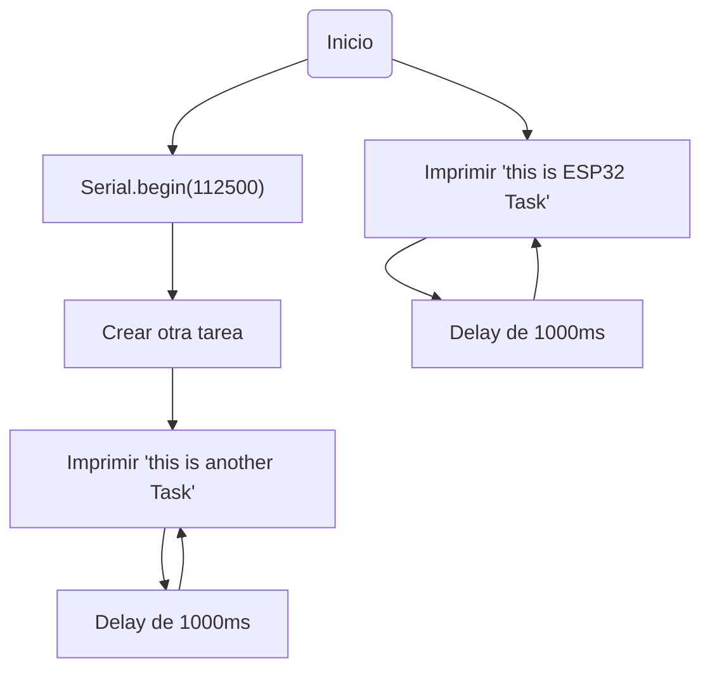

# PRACTICA-4
# Práctica 4: Sistemas Operativos en Tiempo Real

### Nuestro objetivo
El propósito de esta práctica es entender el comportamiento de un sistema operativo en tiempo real (RTOS). Para lograrlo, se llevarán a cabo actividades prácticas en las que se diseñarán y pondrán en marcha varias tareas en un microcontrolador ESP32 haciendo uso de FreeRTOS, analizando cómo se reparte el uso del procesador entre ellas.

### Que material necesitamos ? 
Para el desarrollo de esta práctica, se requiere contar con los siguientes elementos:
Un microcontrolador ESP32-S3
El entorno de desarrollo Arduino IDE
---

# *Parte 1*

### Code
```cpp
    #include <Arduino.h>

    void anotherTask( void * parameter );
    void setup()
    {
        Serial.begin(112500);
        /* we create a new task here */
        xTaskCreate(
        anotherTask, /* Task function. */
        "another Task", /* name of task. */
        10000, /* Stack size of task */
        NULL, /* parameter of the task */
        1, /* priority of the task */
        NULL); /* Task handle to keep track of created task */
    }
    /* the forever loop() function is invoked by Arduino ESP32 loopTask */
    void loop()
    {
        Serial.println("this is ESP32 Task");
        delay(1000);
    }
    /* this function will be invoked when additionalTask was created */
    void anotherTask( void * parameter )
    {
        /* loop forever */
        for(;;)
        {
            Serial.println("this is another Task");
            delay(1000);
        }
        /* delete a task when finish,
        this will never happen because this is infinity loop */
        vTaskDelete( NULL );
    }
```

### Descripción y Funcionamiento
El código implementa un sistema operativo de tiempo real donde se generan dos procesos paralelos:

Proceso principal: Se ejecuta en la función loop(), mostrando repetidamente en el puerto serie el mensaje "this is ESP32 Task" cada segundo.

Proceso secundario: Creado en setup() mediante xTaskCreate(). Su función es mostrar "this is another Task" cada segundo dentro de un ciclo infinito.

Ambos procesos se ejecutan simultáneamente gracias a FreeRTOS, compartiendo el tiempo de CPU entre ellos.

### Expected output
```
this is another Task
this is ESP32 Task
this is another Task
this is ESP32 Task
```

### Diagrama


---

# *Parte 2*

### Código
```cpp
#include <Arduino.h>
#include <FreeRTOS.h>
#include <task.h>
#include <semphr.h>

const int ledPin = 11;
SemaphoreHandle_t semaphore;

void setup() {
    Serial.begin(115200);
    pinMode(ledPin, OUTPUT);
    semaphore = xSemaphoreCreateBinary();
    
    xTaskCreate(encenderLED, "Encender LED", 1000, NULL, 1, NULL);
    xTaskCreate(apagarLED, "Apagar LED", 1000, NULL, 1, NULL);
}

void loop() {
}

void encenderLED(void *parameter) {
    for (;;) {
        digitalWrite(ledPin, HIGH);
        Serial.println("LED HIGH");
        delay(1000);
        xSemaphoreGive(semaphore);
    }
}

void apagarLED(void *parameter) {
    for (;;) {
        digitalWrite(ledPin, LOW);
        Serial.println("LED LOW");
        delay(1000);
        xSemaphoreGive(semaphore);
    }
}
```

### Como funciona ?
Este programa emplea un semáforo para sincronizar dos procesos:

Proceso encenderLED(): Activa un LED, muestra "LED HIGH" y pausa un segundo.

Proceso apagarLED(): Desactiva el LED, imprime "LED LOW" y detiene la ejecución por un segundo.

Los procesos se alternan cada segundo gracias a la gestión del semáforo.

### Expected output:
```
LED HIGH
LED LOW
LED HIGH
LED LOW
```

---

## CONCLUSION
Esta actividad nos brindó la oportunidad de trabajar con FreeRTOS y entender cómo es posible ejecutar varias tareas simultáneamente en un microcontrolador ESP32. En la primera sección, observamos la creación de tareas paralelas y, en la segunda, analizamos la coordinación entre ellas mediante el uso de un semáforo. Esto evidencia la capacidad de los sistemas operativos en tiempo real para manejar de manera eficiente la ejecución de procesos.


# PARA MEJORAR NOTA

## Reloj
*CODE*
```cpp
#include <Arduino.h>
#include "freertos/FreeRTOS.h"
#include "freertos/task.h"
#include "freertos/queue.h"
#include "freertos/semphr.h"


// Definición de pines
#define LED_SEGUNDOS 2  
#define LED_MODO 40    
#define BTN_MODO 48    
#define BTN_INCREMENTO 36


// Variables globales del reloj
volatile int horas = 0, minutos = 0, segundos = 0;
volatile int modo = 0;  


// Recursos FreeRTOS
QueueHandle_t botonQueue;
SemaphoreHandle_t relojMutex;


// Estructura para eventos de botón
typedef struct {
    uint8_t boton;
    uint32_t tiempo;
} EventoBoton;


void IRAM_ATTR ISR_Boton(void *arg) {
    uint8_t numeroPulsador = (uint32_t)arg;
    EventoBoton evento = {numeroPulsador, xTaskGetTickCountFromISR()};
    xQueueSendFromISR(botonQueue, &evento, NULL);
}


void TareaReloj(void *pvParameters) {
    TickType_t xLastWakeTime = xTaskGetTickCount();
    const TickType_t xPeriod = pdMS_TO_TICKS(1000);
   
    for (;;) {
        vTaskDelayUntil(&xLastWakeTime, xPeriod);
        if (xSemaphoreTake(relojMutex, portMAX_DELAY)) {
            if (modo == 0) {
                segundos++;
                if (segundos == 60) {
                    segundos = 0;
                    minutos++;
                    if (minutos == 60) {
                        minutos = 0;
                        horas = (horas + 1) % 24;
                    }
                }
            }
            xSemaphoreGive(relojMutex);
        }
    }
}


void TareaLecturaBotones(void *pvParameters) {
    EventoBoton evento;
    for (;;) {
        if (xQueueReceive(botonQueue, &evento, portMAX_DELAY)) {
            if (xSemaphoreTake(relojMutex, portMAX_DELAY)) {
                if (evento.boton == BTN_MODO) {
                    modo = (modo + 1) % 3;
                } else if (evento.boton == BTN_INCREMENTO) {
                    if (modo == 1) horas = (horas + 1) % 24;
                    if (modo == 2) minutos = (minutos + 1) % 60;
                }
                xSemaphoreGive(relojMutex);
            }
        }
    }
}


void TareaActualizacionDisplay(void *pvParameters) {
    int last_h = -1, last_m = -1, last_s = -1, last_modo = -1;
    for (;;) {
        if (xSemaphoreTake(relojMutex, portMAX_DELAY)) {
            if (horas != last_h || minutos != last_m || segundos != last_s || modo != last_modo) {
                Serial.printf("Hora: %02d:%02d:%02d  | Modo: %d\n", horas, minutos, segundos, modo);
                last_h = horas; last_m = minutos; last_s = segundos; last_modo = modo;
            }
            xSemaphoreGive(relojMutex);
        }
        vTaskDelay(pdMS_TO_TICKS(500));
    }
}


void TareaControlLEDs(void *pvParameters) {
    for (;;) {
        digitalWrite(LED_SEGUNDOS, segundos % 2);
        digitalWrite(LED_MODO, modo != 0);
        vTaskDelay(pdMS_TO_TICKS(500));
    }
}


void setup() {
    Serial.begin(115200);
    pinMode(LED_SEGUNDOS, OUTPUT);
    pinMode(LED_MODO, OUTPUT);
    pinMode(BTN_MODO, INPUT_PULLUP);
    pinMode(BTN_INCREMENTO, INPUT_PULLUP);


    relojMutex = xSemaphoreCreateMutex();
    botonQueue = xQueueCreate(10, sizeof(EventoBoton));


    attachInterrupt(BTN_MODO, ISR_Boton, FALLING);
    attachInterrupt(BTN_INCREMENTO, ISR_Boton, FALLING);


    xTaskCreate(TareaReloj, "Tarea Reloj", 2048, NULL, 2, NULL);
    xTaskCreate(TareaLecturaBotones, "Lectura Botones", 2048, NULL, 2, NULL);
    xTaskCreate(TareaActualizacionDisplay, "Actualización Display", 2048, NULL, 1, NULL);
    xTaskCreate(TareaControlLEDs, "Control LEDs", 2048, NULL, 1, NULL);
}


void loop() {
    vTaskDelay(portMAX_DELAY);
}
```
Este código implementa un reloj digital en ESP32 con FreeRTOS. Permite mostrar la hora, cambiar modos y ajustar horas y minutos mediante botones.

Componentes clave:

Colas y mutex: Gestionan eventos y protegen variables compartidas.

Tareas: Actualizan el reloj, manejan botones, muestran la hora en el puerto serie y controlan LEDs.

Características:

Multitarea: Las tareas se ejecutan simultáneamente para mantener el reloj activo y responder a botones.

Interactividad: Los botones ajustan la hora sin interrumpir el funcionamiento.

En resumen, es un reloj digital eficiente y ajustable con FreeRTOS.

La salida que se ve en la pantalla es:
```
Hora: 12:34:56  | Modo: 0
Hora: 12:34:57  | Modo: 0
Hora: 12:34:58  | Modo: 0
...

```
### **Juego Web:**
**Codigo:**
```cpp
#include <Arduino.h>
 #include <WiFi.h>
 #include <AsyncTCP.h>
 #include <ESPAsyncWebServer.h>
 #include <SPIFFS.h>
 #include "freertos/FreeRTOS.h"
 #include "freertos/task.h"
 #include "freertos/queue.h"
 #include "freertos/semphr.h"
 
 // Configuración de red WiFi
 const char* ssid = "ESP32_Game";
 const char* password = "12345678";
 
 // Definición de pines
 #define LED1 2
 #define LED2 4
 #define LED3 5
 #define BTN1 16
 #define BTN2 17
 #define BTN3 18
 #define LED_STATUS 19
 
 // Variables del juego
 volatile int puntuacion = 0;
 volatile int tiempoJuego = 30;
 volatile int ledActivo = -1;
 volatile bool juegoActivo = false;
 volatile int dificultad = 1;
 
 // Recursos RTOS
 QueueHandle_t botonQueue;
 SemaphoreHandle_t juegoMutex;
 TaskHandle_t tareaJuegoHandle = NULL;
 AsyncWebServer server(80);
 AsyncEventSource events("/events");
 
 // Estructura para eventos de botones
 typedef struct {
   uint8_t boton;
   uint32_t tiempo;
 } EventoBoton;
 
 // Función de interrupción para los botones
 void IRAM_ATTR ISR_Boton(void *arg) {
   EventoBoton evento;
   evento.boton = (uint32_t)arg;
   evento.tiempo = xTaskGetTickCountFromISR();
   xQueueSendFromISR(botonQueue, &evento, NULL);
 }
 
 // Configuración inicial del ESP32
 void setup() {
   Serial.begin(115200);
   if(!SPIFFS.begin(true)) Serial.println("Error al montar SPIFFS");
 
   pinMode(LED1, OUTPUT);
   pinMode(LED2, OUTPUT);
   pinMode(LED3, OUTPUT);
   pinMode(LED_STATUS, OUTPUT);
   pinMode(BTN1, INPUT_PULLUP);
   pinMode(BTN2, INPUT_PULLUP);
   pinMode(BTN3, INPUT_PULLUP);
 
   botonQueue = xQueueCreate(10, sizeof(EventoBoton));
   juegoMutex = xSemaphoreCreateMutex();
 
   attachInterruptArg(BTN1, ISR_Boton, (void*)BTN1, FALLING);
   attachInterruptArg(BTN2, ISR_Boton, (void*)BTN2, FALLING);
   attachInterruptArg(BTN3, ISR_Boton, (void*)BTN3, FALLING);
 
   WiFi.softAP(ssid, password);
   Serial.print("Dirección IP: "); Serial.println(WiFi.softAPIP());
 
   server.on("/", HTTP_GET, [](AsyncWebServerRequest *request){
     request->send(SPIFFS, "/index.html", "text/html");
   });
 
   server.on("/toggle", HTTP_GET, [](AsyncWebServerRequest *request){
     juegoActivo = !juegoActivo;
     request->send(200, "text/plain", "OK");
   });
 
   server.on("/difficulty", HTTP_GET, [](AsyncWebServerRequest *request){
     if (request->hasParam("value")) {
       int valor = request->getParam("value")->value().toInt();
       if (valor >= 1 && valor <= 5) dificultad = valor;
     }
     request->send(200, "text/plain", "OK");
   });
 
   events.onConnect([](AsyncEventSourceClient *client){
     client->send("{}", "update", millis());
   });
   server.addHandler(&events);
   server.begin();
 
   xTaskCreate(TareaJuego, "JuegoTask", 2048, NULL, 1, &tareaJuegoHandle);
   xTaskCreate(TareaLecturaBotones, "BotonesTask", 2048, NULL, 2, NULL);
   xTaskCreate(TareaTiempo, "TiempoTask", 2048, NULL, 1, NULL);
 }
 
 void loop() {
   vTaskDelay(portMAX_DELAY);
 }
 
 void TareaJuego(void *pvParameters) {
   int ultimoLed = -1;
   for (;;) {
     if (juegoActivo) {
       int nuevoLed;
       do { nuevoLed = random(0, 3); } while (nuevoLed == ultimoLed);
       ledActivo = nuevoLed;
       ultimoLed = nuevoLed;
       digitalWrite(LED1, ledActivo == 0);
       digitalWrite(LED2, ledActivo == 1);
       digitalWrite(LED3, ledActivo == 2);
     }
     vTaskDelay(pdMS_TO_TICKS(1000 - (dificultad * 150)));
   }
 }
 
 void TareaLecturaBotones(void *pvParameters) {
   EventoBoton evento;
   for (;;) {
     if (xQueueReceive(botonQueue, &evento, portMAX_DELAY)) {
       if (juegoActivo) {
         int botonPresionado = (evento.boton == BTN1) ? 0 : (evento.boton == BTN2) ? 1 : 2;
         if (botonPresionado == ledActivo) puntuacion++;
         else if (puntuacion > 0) puntuacion--;
       }
     }
   }
 }
 
 void TareaTiempo(void *pvParameters) {
   for (;;) {
     if (juegoActivo && tiempoJuego > 0) {
       tiempoJuego--;
       if (tiempoJuego == 0) juegoActivo = false;
     }
     vTaskDelay(pdMS_TO_TICKS(1000));
   }
 }

```
Este código desarrolla un juego de reflejos en un ESP32 con WiFi y FreeRTOS. El sistema permite controlar el juego vía servidor web y responde a botones físicos.

Componentes principales:

Servidor Web:
El ESP32 crea un punto de acceso llamado ESP32_Game para iniciar/detener el juego y ajustar dificultad, manejando peticiones desde el navegador.

Tareas simultáneas:

LEDs: Enciende aleatoriamente un LED; el jugador debe pulsar el botón correcto para sumar puntos o perderlos si falla.

Temporizador: Controla el tiempo y finaliza el juego cuando termina.

Colas e interrupciones:
Gestionan las pulsaciones de botones en tiempo real sin bloquear otras tareas.

Puerto serie:
Muestra la IP y actualiza puntuación y tiempo en tiempo real.

Características:

Multitarea y WiFi: FreeRTOS y WiFi garantizan ejecución fluida y respuesta rápida.

Interactividad: Responde instantáneamente a interacciones físicas y remotas.

En resumen, el código crea un juego reactivo y eficiente, combinando WiFi para control remoto y FreeRTOS para multitarea.

Y la salida en este caso es:
```
Dirección IP: 192.168.4.1
Juego iniciado
Puntuación: 5
Tiempo restante: 20

```
